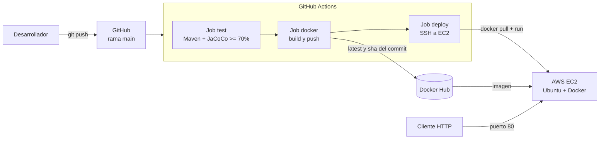

# EVALUACIÓN - PIPELINE CI/CD.

Proyecto con APIs de catálogos y ventas (categorías, productos, clientes y órdenes) desarrollada con Java Spring Boot y SQLite. El proyecto automatiza su ciclo de vida: el `git push` hacía main, ejecuta pruebas, valida la cobertura, publica una imagen en Docker Hub y la despliega en una instancia de AWS EC2. 

## Arquitectura. 


**Flujo:** 
1. Se hace un `git push` o `pull request` hacia la rama `main`.
2. El job `test` hace las pruebas y verifica que la cobertura pase al menos el 70%. Si algo falla, el pipeline se detiene. 
3. El job `docker` construye la imagen y la publica en Docker Hub con dos etiquetas: `latest` y el hash del commit. 
4. El job `deploy` se conecta por SSH a la instancia, descarga la imagen más reciente, detiene el contenedor anterior y levanta el nuevo mapeando el puerto 80 al 8080 del contenedor. 

Los `pull requests` solo ejecutan pruebas; la publicación y el despliegue ocurren únicamente con `push` a `main`. 

## Tecnologías. 

| Componente | Tecnología |
|---|---|
| Lenguaje y framework | Java 21, Spring Boot 4.1.1 |
| Persistencia | SQLite (Spring Data JPA y JdbcTemplate) |
| Pruebas | JUnit 5, Mockito, MockMvc |
| Cobertura | JaCoCo |
| Contenedores | Docker |
| CI/CD | GitHub Actions |
| Registro de imágenes | Docker Hub |
| Infraestructura | AWS EC2 (Ubuntu Server) |

## Estructura del proyecto. 
```
.
├── .github/workflows/main.yml   # Pipeline
├── src/
│   ├── main/java/...            # Controllers, entidades, DTO, repositorios
│   └── test/java/...            # Pruebas unitarias
├── Dockerfile                   # Imagen multi-etapa
├── .dockerignore
├── pom.xml
└── README.md
```

## Endpoints. 

| Recurso | Métodos |
|---|---|
| `/api/categorias` | GET |
| `/api/productos` | GET, POST |
| `/api/productos/{id}` | PUT, DELETE |
| `/api/productos/{id}/stock` | PATCH |
| `/api/clientes` | GET, POST |
| `/api/ordenes` | GET, POST |
| `/api/backup` | POST |
| `/api/database` | DELETE |
| `/api/health` | GET |

## Comandos locales. 

**Requisitos:** JDK 21, Maven y Docker Desktop. 

```bash
# Ejecutar pruebas y verificar cobertura
./mvnw verify

# Levantar la API en local
./mvnw spring-boot:run

# Empaquetar el .jar
./mvnw package -DskipTests
```

La API queda disponible en `http://localhost:8080/api/health`.

## Pruebas y cobertura.

Las pruebas usan `@WebMvcTest` con repositorios simulados (Mockito). Cubren el caso feliz de cada endpoint y los errores que un usuario puede cometer.
```bash 
./mwnw verify 
```
- El reporte HTML queda en `target/site/jacoco/index.html`- 
- Si la cobertura baja del 70%, el build falla. 
- En el pipeline, el resumen de cobertura se imprime en los logs y el reporte completo se sube como artefacto. 

## Docker

Construir y probar en local:
```bash 
docker build -t evaluacion1 . 
docker run -p 8080:8080 evaluacion1
```

Después abre `http://localhost:8080/api/health`. 

La base de datos se guarda en un volumen para no perder datos entre despliegues.
```
docker run -d --name evaluacion1 \
    -p 80:8080 \
    -v api-data:/data \
    -e DB_PATH=/data/app.db \
    <usuario>/evaluacion1:latest
```

`.dockerignore` excluye `target/`, `.git/`, `.env`, logs, base de datos locales y archivos de IDE. 

## Pipeline de GitHub Actions 

Archivo: `.github/workflows/main.yml`

| Job | Cuándo corre | Qué hace |
|---|---|---|
| `test` | `push` y `pull_request` a `main` | `./mvnw -B verify`, resumen de cobertura y subida del reporte JaCoCo |
| `docker` | Solo `push`, tras `test` | Login en Docker Hub con PAT, build y push con las etiquetas `latest` y `${{ github.sha }}` |
| `deploy` | Tras `docker` | SSH a la EC2, `docker pull`, detiene y elimina el contenedor anterior, levanta el nuevo en el puerto 80 |

### Secrets requeridos. 

Configurados en *Settings → Secrets and variables → Actions*.
| Secret | Descripción |
|---|---|
| `DOCKERHUB_USERNAME` | Usuario de Docker Hub |
| `DOCKERHUB_TOKEN` | Personal Access Token de Docker Hub (permisos de lectura y escritura) |
| `EC2_HOST` | IP pública de la instancia EC2 |
| `EC2_USER` | Usuario SSH (`ubuntu`) |
| `EC2_SSH_KEY` | Contenido completo del `.pem` |

## Configuración paso a paso. 

### 1. Docker Hub. 

1. Crea una cuenta en https://hub.docker.com y un repositorio llamado "evaluacion1". 
2. Ve a *Account Settings → Personal access tokens* y genera un token con permisos de lectura y escritura.

### 2. AWS EC2.
1. Lanza una instancia **Ubuntu Server**. 
2. Crea un *key pair* tipo RSA en formato `.pem`. 
3. Configura el **Security Group** con reglas de entrada:
   | Puerto | Protocolo | Origen | Uso |
   |---|---|---|---|
   | 22 | TCP | `0.0.0.0/0` | SSH (necesario para que GitHub Actions entre) |
   | 80 | TCP | `0.0.0.0/0` | HTTP de la API |
4. Asocia una **Elastic IPP** para que la dirección no cambie al reiniciar instancias. 

### 3. Instalar Docker en la EC2. 

```bash
ssh -i "ruta/a/llave.pem" ubuntu@<IP_EC2>

sudo apt update
sudo apt install -y docker.io
sudo systemctl enable --now docker
sudo usermod -aG docker ubuntu
```

Cierra la sesión y vuelve a entrar para que el grupo `docker` surta efecto. 

### 4. GitHub. 

1. Sube el proyecto a un repositorio en la rama `main`. 
2. Crea los 5 secrets de la tabla anterior. 
3. Haz `git push` y revisa la pestaña **Actions**: los 3 jobs deben quedar en verde. 

### 5. Verificar el despliegue. 

```bash
curl http://<IP_EC2>/api/health
```
Debe responder `{"statucCode":200, "data":[{"HOLA":"KAROL"}]}`

## Solución de problemas

| Síntoma | Causa probable | Solución |
|---|---|---|
| `./mvnw: Permission denied` | Windows no guarda el permiso de ejecución | `git update-index --chmod=+x mvnw` |
| `Coverage checks have not been met` | Cobertura menor a 70% | Revisar `target/site/jacoco/index.html` y agregar pruebas |
| `invalid reference format` en el job `docker` | Secret `DOCKERHUB_USERNAME` vacío o mal escrito | Revisar el nombre y el valor del secret |
| `ssh: no key found` | `EC2_SSH_KEY` incompleto | Pegar el `.pem` completo, con `BEGIN` y `END` |
| `unable to authenticate, attempted methods [none publickey]` | La llave no coincide con la instancia, o `EC2_HOST`/`EC2_USER` incorrectos | Probar `ssh -i llave.pem ubuntu@IP` desde la PC y revisar los secrets |
| `connection timed out` | Puerto 22 cerrado o IP incorrecta | Revisar el Security Group y `EC2_HOST` |
| `docker: permission denied` en la EC2 | El usuario no está en el grupo `docker` | `sudo usermod -aG docker ubuntu` y reconectar |
| `Cannot connect to the Docker daemon` en Windows | Docker Desktop no está abierto | Abrir Docker Desktop y esperar a "Engine running" |

## Autor. 
- Karol Gotetty Vázquez Arvizu :) 